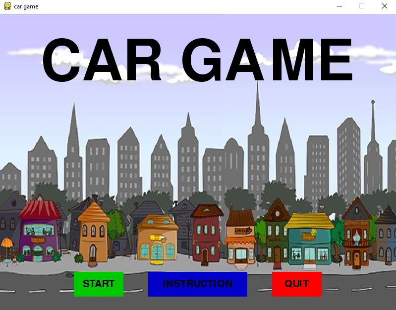

<a href="#">
  <div align="center">
    
  </div>
</a>

<h1 align="center">Car Game built with Python and Pygame</h1>

This is a car game with controls of arrow keys to move left and right.This game is made in python using Pygame library. 

[](#)
[](#)
[](https://www.github.com/saadhaxxan/AIPakistan/fork)
[](https://www.github.com/saadhaxxan/AIPakistan/issues)
[](#)

## Installation steps

1. Install pygame using pip so type the text written below in cmd.

```
pip install pygame
```
2.Goto the project directory and run the script game.py or type the text below into cmd.

```
python game.py
```
thats it you are ready to play.
# Enjoy
